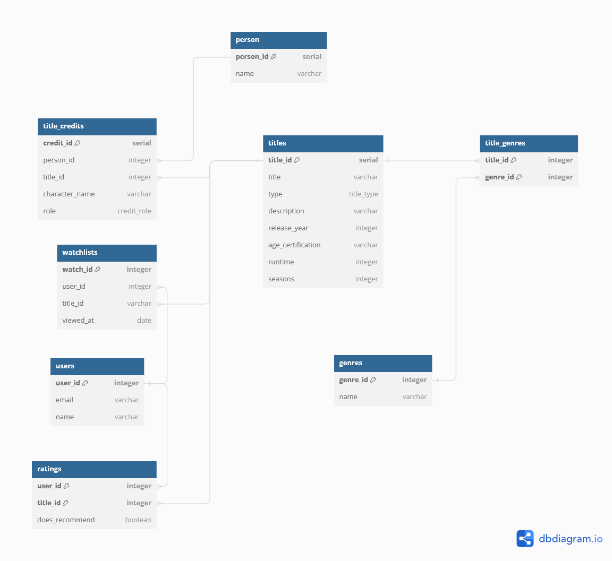

# Streamify
## Description 
### Organisation et situation 
Streamify est une application qui modélise une base de données qui contient l’ensemble de films et séries présents dans Netflix. Le but est de permettre aux utilisateurs de Streamify d’avoir à leur disposition une quantité de films qui leur convient et d’arriver à gérer tout ça de la façon correcte. 

### Quelques métriques
Streamify gère une base de données d’environ 5000 films et séries. Les données sur ces films incluent le titre, le directeur, les acteurs principaux, le pays de provenance et la durée.
Nous gérons également une trentaine d’utilisateurs, les données de leurs profils ainsi que les films qu’ils ont vu sur notre plateforme afin de pouvoir affiner nos recommandations.

### Familiarité avec la situation
Il est toujours agréable de regarder un film ou une série pour s’amuser donc nous avons décidé de mettre en place une base de données qui peut nous aider à nous montrer les films qui nous aimons le plus.

### Aspects à modéliser
- Profils d’utilisateurs, liés à un compte, qui représentent chacun une personne, son nom, les films/séries qu'elle a regardé.
- Cast des film et séries (réalisateur, acteurs, …)
- Catégories de film/série
- Films et séries
- Visionnage de films et séries par les utilisateurs, enregistre la date à laquelle un utilisateur a visionné un certain film/série. 
- Avis de films et séries par les utilisateurs, les utilisateurs peuvent recommander ou non le film après l'avoir vu.

### Challenges et choses difficiles à modéliser
Les défis sont de modéliser une base qui réponde à la troisième forme normale, de traiter les données de films trouvés en ligne pour pouvoir les stocker sur notre base et de pouvoir créer une liste de recommandations pour chaque utilisateur.

### Données à disposition 
Pour la génération des utilisateurs, on va créer des personnes inventées. Par contre, pour les films on va s’appuyer sur une base de données Netflix qu’on a trouvé en ligne (https://www.kaggle.com/datasets/victorsoeiro/netflix-tv-shows-and-movies/ ). Dans cet ensemble de données on peut trouver deux tables. La première contient des informations concernant les titres et dans le deuxième on trouve les acteurs ou directeurs qui ont tournées les films. Elle est déja presque structurée comme on le souhaite et cela devrait nous épargner quelques efforts.

## Schema

## Data seeding

### Import titles 
First, copy both csv files to your docker instance.
\
``docker cp data/titles.csv postgres:titles.csv``\
``docker cp data/credits.csv postgres:credits.csv``

Then you can run `load_titles_data.sql` however you like.